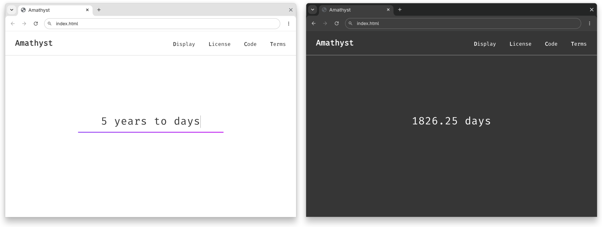

**Deprecated:** Amathyst was a front-end for [math.js](https://mathjs.org/). It was completed in part as a school assignment in Grade 9.

To test Amathyst, start `chromium` with `--allow-file-access-from-files` or host it on a local web server.

___

 

  

  <h3 align="center">Amathyst</h3>

  

    A fast and powerful command-based calculator with minimal layout.
     
     
  

## License

Distributed under the MIT License. See `LICENSE.md` for more information.

(<a href="#readme-top">back to top</a>)

